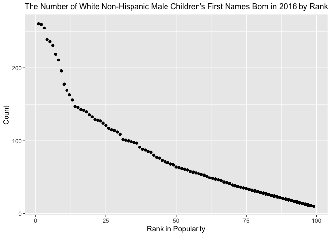

p8105\_hw2\_sl4836
================
Hun
10/5/2021

``` r
library(tidyverse)
library(readxl)
```

## Problem 0

``` r
getwd()
```

    ## [1] "/Users/iseonghun/p8105_hw2_sl4836"

``` r
dir.create(file.path(getwd(), "local_data_file"), recursive = TRUE)

list.files()
```

    ## [1] "local_data_file"        "p8105_hw2_sl4836_files" "p8105_hw2_sl4836.md"   
    ## [4] "p8105_hw2_sl4836.Rmd"   "p8105_hw2_sl4836.Rproj"

## Problem 1 (Trash Wheel Data)

``` r
clean_trash_data <- read_excel(
  "local_data_file/Trash-Wheel-Collection-Totals-7-2020-2.xlsx", 
  sheet = "Mr. Trash Wheel", range = "A2:N408") %>%
  janitor::clean_names() %>%
  filter(!str_detect(month, 'Total')) %>% 
  mutate(sports_balls = round(sports_balls))

clean_trash_data 
```

    ## # A tibble: 345 × 14
    ##    dumpster month  year date                weight_tons volume_cubic_yards
    ##       <dbl> <chr> <dbl> <dttm>                    <dbl>              <dbl>
    ##  1        1 May    2014 2014-05-16 00:00:00        4.31                 18
    ##  2        2 May    2014 2014-05-16 00:00:00        2.74                 13
    ##  3        3 May    2014 2014-05-16 00:00:00        3.45                 15
    ##  4        4 May    2014 2014-05-17 00:00:00        3.1                  15
    ##  5        5 May    2014 2014-05-17 00:00:00        4.06                 18
    ##  6        6 May    2014 2014-05-20 00:00:00        2.71                 13
    ##  7        7 May    2014 2014-05-21 00:00:00        1.91                  8
    ##  8        8 May    2014 2014-05-28 00:00:00        3.7                  16
    ##  9        9 June   2014 2014-06-05 00:00:00        2.52                 14
    ## 10       10 June   2014 2014-06-11 00:00:00        3.76                 18
    ## # … with 335 more rows, and 8 more variables: plastic_bottles <dbl>,
    ## #   polystyrene <dbl>, cigarette_butts <dbl>, glass_bottles <dbl>,
    ## #   grocery_bags <dbl>, chip_bags <dbl>, sports_balls <dbl>,
    ## #   homes_powered <dbl>

## Problem 1 (Precipitation 2018, 2019 Data)

``` r
clean_precipation_2018_data <- read_excel(
  "local_data_file/Trash-Wheel-Collection-Totals-7-2020-2.xlsx", 
  sheet = "2018 Precipitation",
  range = "A2:B15") %>% janitor::clean_names() %>% mutate(year = "2018") %>% 
  relocate(year) %>%
  drop_na()

clean_precipation_2019_data <- read_excel(
  "local_data_file/Trash-Wheel-Collection-Totals-7-2020-2.xlsx", 
  sheet = "2019 Precipitation",
  range = "A2:B15") %>% janitor::clean_names() %>% mutate(year = "2019") %>%
  relocate(year) %>%
  drop_na()

combined_precipitation <- bind_rows(clean_precipation_2018_data, 
                                    clean_precipation_2019_data) %>%
  mutate(month = month.name[month]) %>% 
  relocate(year)

combined_precipitation
```

    ## # A tibble: 24 × 3
    ##    year  month     total
    ##    <chr> <chr>     <dbl>
    ##  1 2018  January    0.94
    ##  2 2018  February   4.8 
    ##  3 2018  March      2.69
    ##  4 2018  April      4.69
    ##  5 2018  May        9.27
    ##  6 2018  June       4.77
    ##  7 2018  July      10.2 
    ##  8 2018  August     6.45
    ##  9 2018  September 10.5 
    ## 10 2018  October    2.12
    ## # … with 14 more rows

# Data Summarization of thef Problem\_1 Datasets

``` r
trash_variables <- names(clean_trash_data)
trash_nrow <- nrow(clean_trash_data)
trash_ncol <- ncol(clean_trash_data)
median_sports_balls <- clean_trash_data %>% 
  filter(year == 2019) %>% 
  summarise(median(sports_balls)) 
mean_sports_balls <- clean_trash_data %>% 
  filter(year == 2019) %>%  summarise(mean(sports_balls))
  

prec_2018_variables <- names(clean_precipation_2018_data)
prec_2018_nrow <- nrow(clean_precipation_2018_data)
prec_2018_ncol <- ncol(clean_precipation_2018_data)
total_precip_2018 <- clean_precipation_2018_data %>% summarise(sum(total))


prec_2019_variables <- names(clean_precipation_2019_data)
prec_2019_nrow <- nrow(clean_precipation_2019_data)
prec_2019_ncol <- ncol(clean_precipation_2019_data)
total_precip_2019 <- clean_precipation_2019_data %>% summarise(sum(total))

prec_combined_variables <- names(combined_precipitation)
prec_combined_nrow <- nrow(combined_precipitation)
prec_combined_ncol <- ncol(combined_precipitation)
total_combined_precip <- combined_precipitation %>% summarise(sum(total))
```

The dimension of the trash\_data is **345 x** **14.** There are **345**
number of observations and **14** variables: *dumpster, month, year,
date, weight\_tons, volume\_cubic\_yards, plastic\_bottles, polystyrene,
cigarette\_butts, glass\_bottles, grocery\_bags, chip\_bags,
sports\_balls, homes\_powered.* The median number of sports balls in a
dumpster in 2019 is **9.** The mean number of sports balls in a dumpster
in 2019 is **9.1290323**

The dimension of the 2018 precipitation data is **12 x** **3.** There
are **12** number of observations and **3** variables: *year, month,
total.* The total precipitation in 2018 is **70.33**

The dimension of the 2019 precipitation data is **12 x** **3.** There
are **12** number of observations and **3** variables: *year, month,
total.* The total precipitation in 2019 is **33.95**

The dimension of the combined precipitation data is **24 x** **3.**
There are **24** number of observations and **3** variables: *year,
month, total.* The total precipitation of the combined 2018 and 2019 is
**104.28**

## Problem 2 (1 - Pols Month Data)

``` r
pols_month_data <- read_csv("local_data_file/pols-month.csv")

clean_pols_month_data <- pols_month_data %>%
  janitor::clean_names() %>% 
  separate("mon", c("year", "month", "day"), sep = "-") %>% 
  mutate(across(.cols = c("year", "month", "day"), as.integer)) %>% 
  mutate(month = month.name[month])  %>% 
  mutate(president = case_when(prez_dem == 1 ~ "dem",
                               prez_gop == 1 ~ "gop",
                               prez_gop == 2 ~ "gop")) %>%
    select(-day, -prez_dem, -prez_gop)
  

clean_pols_month_data
```

    ## # A tibble: 822 × 9
    ##     year month     gov_gop sen_gop rep_gop gov_dem sen_dem rep_dem president
    ##    <int> <chr>       <dbl>   <dbl>   <dbl>   <dbl>   <dbl>   <dbl> <chr>    
    ##  1  1947 January        23      51     253      23      45     198 dem      
    ##  2  1947 February       23      51     253      23      45     198 dem      
    ##  3  1947 March          23      51     253      23      45     198 dem      
    ##  4  1947 April          23      51     253      23      45     198 dem      
    ##  5  1947 May            23      51     253      23      45     198 dem      
    ##  6  1947 June           23      51     253      23      45     198 dem      
    ##  7  1947 July           23      51     253      23      45     198 dem      
    ##  8  1947 August         23      51     253      23      45     198 dem      
    ##  9  1947 September      23      51     253      23      45     198 dem      
    ## 10  1947 October        23      51     253      23      45     198 dem      
    ## # … with 812 more rows

## Problem 2 (2 - Snp Data)

``` r
snp_data <- read_csv("local_data_file/snp.csv")

clean_snp_data <- snp_data %>% 
  separate("date", c("month", "day", "year"), sep = "/") %>%
  mutate(across(.cols = c("year", "month", "day"), as.integer)) %>%
  relocate(year, month) %>%
  mutate(month = month.name[month]) %>% 
  mutate(year = as.numeric(year)) %>% 
  mutate(year = ifelse(year<21, year+2000, year+1900)) %>% 
  select(-day)

clean_snp_data
```

    ## # A tibble: 787 × 3
    ##     year month    close
    ##    <dbl> <chr>    <dbl>
    ##  1  2015 July     2080.
    ##  2  2015 June     2063.
    ##  3  2015 May      2107.
    ##  4  2015 April    2086.
    ##  5  2015 March    2068.
    ##  6  2015 February 2104.
    ##  7  2015 January  1995.
    ##  8  2014 December 2059.
    ##  9  2014 November 2068.
    ## 10  2014 October  2018.
    ## # … with 777 more rows

## Problem 2 (3 - Unemployment Data)

``` r
unemployment_data <- read_csv("local_data_file/unemployment.csv")

clean_unemployment_data <- unemployment_data %>% 
  pivot_longer(Jan:Dec, names_to = "month", values_to = "unemployment_percent") %>% 
  janitor::clean_names() %>% 
  mutate(across(.cols = c("year"), as.integer))  %>%
  mutate(month = match(month, month.abb)) %>%
  mutate(month = month.name[month])

clean_unemployment_data
```

    ## # A tibble: 816 × 3
    ##     year month     unemployment_percent
    ##    <int> <chr>                    <dbl>
    ##  1  1948 January                    3.4
    ##  2  1948 February                   3.8
    ##  3  1948 March                      4  
    ##  4  1948 April                      3.9
    ##  5  1948 May                        3.5
    ##  6  1948 June                       3.6
    ##  7  1948 July                       3.6
    ##  8  1948 August                     3.9
    ##  9  1948 September                  3.8
    ## 10  1948 October                    3.7
    ## # … with 806 more rows

\#Join the datasets by merging snp into pols, and merging unemployment
into the result.

``` r
merge1 <- left_join(clean_pols_month_data, clean_snp_data, by = c("year", "month"))

merge2 <- left_join(merge1, clean_unemployment_data, by = c("year", "month"))

merge2
```

    ## # A tibble: 822 × 11
    ##     year month   gov_gop sen_gop rep_gop gov_dem sen_dem rep_dem president close
    ##    <dbl> <chr>     <dbl>   <dbl>   <dbl>   <dbl>   <dbl>   <dbl> <chr>     <dbl>
    ##  1  1947 January      23      51     253      23      45     198 dem          NA
    ##  2  1947 Februa…      23      51     253      23      45     198 dem          NA
    ##  3  1947 March        23      51     253      23      45     198 dem          NA
    ##  4  1947 April        23      51     253      23      45     198 dem          NA
    ##  5  1947 May          23      51     253      23      45     198 dem          NA
    ##  6  1947 June         23      51     253      23      45     198 dem          NA
    ##  7  1947 July         23      51     253      23      45     198 dem          NA
    ##  8  1947 August       23      51     253      23      45     198 dem          NA
    ##  9  1947 Septem…      23      51     253      23      45     198 dem          NA
    ## 10  1947 October      23      51     253      23      45     198 dem          NA
    ## # … with 812 more rows, and 1 more variable: unemployment_percent <dbl>

## short paragraph about the Problem\_2 Datasets

``` r
name_variables <- names(pols_month_data)
nrow <- nrow(pols_month_data)
ncol <- ncol(pols_month_data)

name_variables1 <- names(clean_pols_month_data)
nrow1 <- nrow(clean_pols_month_data)
ncol1 <- ncol(clean_pols_month_data)
range_year1 <- clean_pols_month_data %>% pull(year) %>% range()

name_variables2 <- names(snp_data)
nrow2 <- nrow(snp_data)
ncol2 <- ncol(snp_data)

name_variables3 <- names(clean_snp_data)
nrow3 <- nrow(clean_snp_data)
ncol3 <- ncol(clean_snp_data)
range_year3 <- clean_snp_data %>% pull(year) %>% range()

name_variables4 <- names(unemployment_data)
nrow4 <- nrow(unemployment_data)
ncol4 <- ncol(unemployment_data)

name_variables5 <- names(clean_unemployment_data)
nrow5 <- nrow(clean_unemployment_data)
ncol5 <- ncol(clean_unemployment_data)
range_year5 <- clean_unemployment_data %>% pull(year) %>% range()

name_variables6 <- names(merge1)
nrow6 <- nrow(merge1)
ncol6 <- ncol(merge1)
range_year6 <- merge1 %>% pull(year) %>% range()

name_variables7 <- names(merge2)
nrow7 <- nrow(merge2)
ncol7 <- ncol(merge2)
range_year7 <- merge2 %>% pull(year) %>% range()
```

Originally, the dimension of the pols\_month\_data was **822 x** **9**
and there are **9** variables: *mon, prez\_gop, gov\_gop, sen\_gop,
rep\_gop, prez\_dem, gov\_dem, sen\_dem, rep\_dem.* After tidying it,
the dimension is **822 x** **9.** and there are **9** variables: *year,
month, gov\_gop, sen\_gop, rep\_gop, gov\_dem, sen\_dem, rep\_dem,
president.* The range of years is **\[1947, 2015\].**

Originally, the dimension of the \_data was **787 x** **2** and there
are **2** variables: *date, close.* After tidying it, the dimension is
**787 x** **3.** and there are **3** variables: *year, month, close.*
The range of years is **\[1950, 2015\].**

Origianlly the dimension of the pols\_month\_data was **68 x** **13**
and there are **13** variables: *Year, Jan, Feb, Mar, Apr, May, Jun,
Jul, Aug, Sep, Oct, Nov, Dec.* After tidying it, the dimension is **816
x** **3.** and there are **3** variables: *year, month,
unemployment\_percent.* The range of years is **\[1948, 2015\].**

After joining the datasets by merging snp into pols, the dimension of
the dataset is **822 x** **10** and there are **10** variables: *year,
month, gov\_gop, sen\_gop, rep\_gop, gov\_dem, sen\_dem, rep\_dem,
president, close.* The range of years is **\[1947, 2015\].**

After joining the datasets by additionally merging unemployment to the
merged dataset, the dimension of the dataset is **822 x** **11** and
there are **11** variables: *year, month, gov\_gop, sen\_gop, rep\_gop,
gov\_dem, sen\_dem, rep\_dem, president, close, unemployment\_percent.*
The range of years is **\[1947, 2015\].**

## Problem 3 (Cleaning Baby\_Names Data for Olivia)

``` r
library(dplyr)

baby_names_data <-read_csv("local_data_file/Popular_Baby_Names.csv")
```

    ## 
    ## ── Column specification ────────────────────────────────────────────────────────
    ## cols(
    ##   `Year of Birth` = col_double(),
    ##   Gender = col_character(),
    ##   Ethnicity = col_character(),
    ##   `Child's First Name` = col_character(),
    ##   Count = col_double(),
    ##   Rank = col_double()
    ## )

``` r
clean_baby_names_data <- baby_names_data %>% 
  janitor::clean_names() %>% 
  mutate(gender = str_to_title(gender)) %>% 
  mutate(ethnicity = str_to_title(ethnicity)) %>%
  mutate(childs_first_name = str_to_lower(childs_first_name)) %>%
  distinct() %>% 
  mutate(ethnicity = 
           recode(ethnicity, "White Non Hisp" = 
           "White Non Hispanic", 
           "Black Non Hisp" = "Black Non Hispanic", 
           "Asian And Paci" = "Asian And Pacific Islander"))%>%
  filter(str_detect(childs_first_name, 'olivia')) %>%
  filter(str_detect(gender, 'Female')) %>%
  arrange(year_of_birth)  

clean_baby_names_data
```

    ## # A tibble: 24 × 6
    ##    year_of_birth gender ethnicity                  childs_first_name count  rank
    ##            <dbl> <chr>  <chr>                      <chr>             <dbl> <dbl>
    ##  1          2011 Female Asian And Pacific Islander olivia               89     4
    ##  2          2011 Female Black Non Hispanic         olivia               52    10
    ##  3          2011 Female Hispanic                   olivia               86    18
    ##  4          2011 Female White Non Hispanic         olivia              213     2
    ##  5          2012 Female Asian And Pacific Islander olivia              132     3
    ##  6          2012 Female Black Non Hispanic         olivia               58     8
    ##  7          2012 Female Hispanic                   olivia               77    22
    ##  8          2012 Female White Non Hispanic         olivia              198     4
    ##  9          2013 Female Asian And Pacific Islander olivia              109     3
    ## 10          2013 Female Black Non Hispanic         olivia               64     6
    ## # … with 14 more rows

\#Creating the Table That Shows the Rank of the Name Olivia Popularity
by Ethnicity Over Time.

``` r
clean_baby_names_data %>% select(rank, year_of_birth, ethnicity,
         childs_first_name) %>%
  pivot_wider(names_from = childs_first_name, values_from = rank,
              names_glue = "olivia_rank") %>% 
  pivot_wider(names_from = year_of_birth, values_from
              =olivia_rank) %>%
  mutate_all(~replace(., is.na(.), 0)) %>%
  knitr::kable(caption = "**Table1: The Rank (1st to 102nd) of the Name Olivia Popularity by Ethnicity Over Time**", align = "c", format = "pipe")
```

|         ethnicity          | 2011 | 2012 | 2013 | 2014 | 2015 | 2016 |
|:--------------------------:|:----:|:----:|:----:|:----:|:----:|:----:|
| Asian And Pacific Islander |  4   |  3   |  3   |  1   |  1   |  1   |
|     Black Non Hispanic     |  10  |  8   |  6   |  8   |  4   |  8   |
|          Hispanic          |  18  |  22  |  22  |  16  |  16  |  13  |
|     White Non Hispanic     |  2   |  4   |  1   |  1   |  1   |  1   |

**Table1: The Rank (1st to 102nd) of the Name Olivia Popularity by
Ethnicity Over Time**

\#Cleaning Baby\_names Data for Male

``` r
clean_baby_male_data <- baby_names_data %>% 
  janitor::clean_names() %>%
  mutate(ethnicity = str_to_title(ethnicity), gender = str_to_title(gender), childs_first_name = str_to_title(childs_first_name)) %>%
  filter(str_detect(gender, 'Male') & rank ==1) %>%
  arrange(year_of_birth) %>%
  mutate(ethnicity = 
           recode(ethnicity, 
           "White Non Hisp" = "White Non Hispanic", 
           "Black Non Hisp" = "Black Non Hispanic", 
           "Asian And Paci" = "Asian And Pacific Islander")) %>% 
  select(-count, -gender, -rank) %>%
  distinct()
```

\#Creating the Table That Shows The Most Popular Name Among Male
Children Over Time.

``` r
library(kableExtra)
```

    ## 
    ## Attaching package: 'kableExtra'

    ## The following object is masked from 'package:dplyr':
    ## 
    ##     group_rows

``` r
clean_baby_male_data  %>% 
  pivot_wider(names_from = year_of_birth, values_from =
                childs_first_name ) %>% 
  knitr::kable(caption = "**Table2: The Most Popular Male Names by Ethnicity Over Time**", align = "c", format = "pipe")  
```

|         ethnicity          |  2011   |  2012  |  2013  |  2014  |  2015  |  2016  |
|:--------------------------:|:-------:|:------:|:------:|:------:|:------:|:------:|
| Asian And Pacific Islander |  Ethan  |  Ryan  | Jayden | Jayden | Jayden | Ethan  |
|     Black Non Hispanic     | Jayden  | Jayden | Ethan  | Ethan  |  Noah  |  Noah  |
|          Hispanic          | Jayden  | Jayden | Jayden |  Liam  |  Liam  |  Liam  |
|     White Non Hispanic     | Michael | Joseph | David  | Joseph | David  | Joseph |

**Table2: The Most Popular Male Names by Ethnicity Over Time**

\#Creating a Scaterplot Showing the Number of Children with a Name (y
axis) against the Rank in Popularity of That Name (x axis).

``` r
  baby_names_data %>% 
  janitor::clean_names() %>% 
  distinct() %>%
  mutate(ethnicity = str_to_title(ethnicity), gender = str_to_title(gender)) %>% 
  mutate(ethnicity = 
           recode(ethnicity, 
           "White Non Hisp" = "White Non Hispanic", 
           "Black Non Hisp" = "Black Non Hispanic", 
           "Asian And Paci" = "Asian And Pacific Islander")) %>%
  filter(ethnicity == "White Non Hispanic", gender == "Male",
         year_of_birth == 2016) %>%
  group_by(childs_first_name) %>% 
  ggplot(aes(rank, count)) + geom_point() + 
  labs(title = "The Number of White Non-Hispanic Male Children's First Names Born in 2016 by Rank", x = "Rank in Popularity", 
       y="Count") + theme(plot.title = element_text(hjust = 0.4, size = 12))
```

<!-- -->
